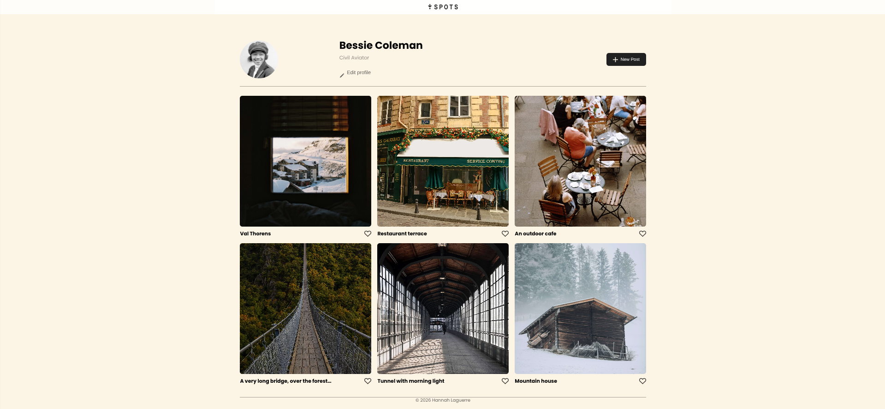
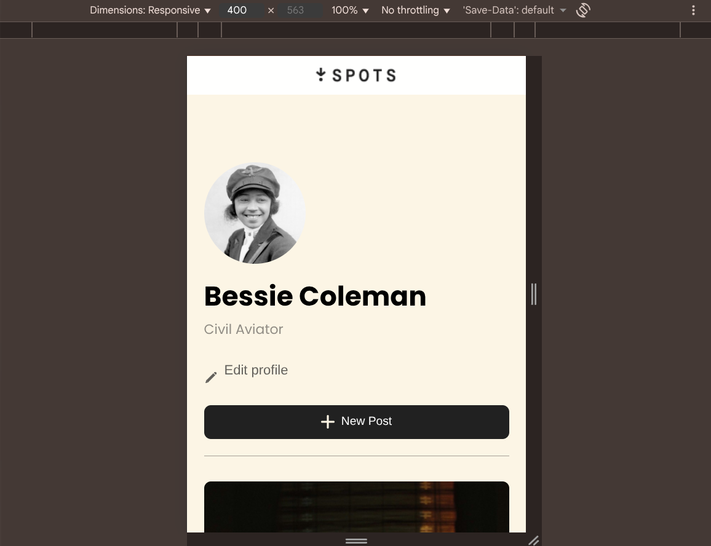

# Project 3: Spots

### Overview  

* Intro  
* Figma  
* Images  
  
**Intro**
  
 Spots is a responsive social-media style webpage created by Hannah Laguerre as part of the TripleTen Web Development program.

 The page shows a user profile and a grid of photo cards that automatically adjust for desktop, tablet, and mobile screens.

 This project helped me practice responsive design, BEM methodology, and real-world layout building.

 Technologies and Techniques Used:
 * HTML5
 * CSS3
 * Flexbox
 * Media Queries
 * Normalize.css
 * Custom fonts(Poppins)

 This project also helped me practice:
 * File structure organization
 * Responsive layouts
 * Text overflow handling
 * Git and GitHub workflow
  
**Figma**  

The page includes:

* Profile section with avatar, name, job title, and edit button
* Add New Post button
* Responsive photo card(3, 2, 1 cards per row)
* Like button on cards
* Footer section
* Overflow handling for long names/descriptions

The layout matches the TripleTen Figma design at different screen sizes.
   
* [Link to the project on Figma](https://www.figma.com/file/BBNm2bC3lj8QQMHlnqRsga/Sprint-3-Project-%E2%80%94-Spots?type=design&node-id=2%3A60&mode=design&t=afgNFybdorZO6cQo-1)
  
  
**Images**  
  
## Desktop View

## Tablet View

## Mobile View

  

