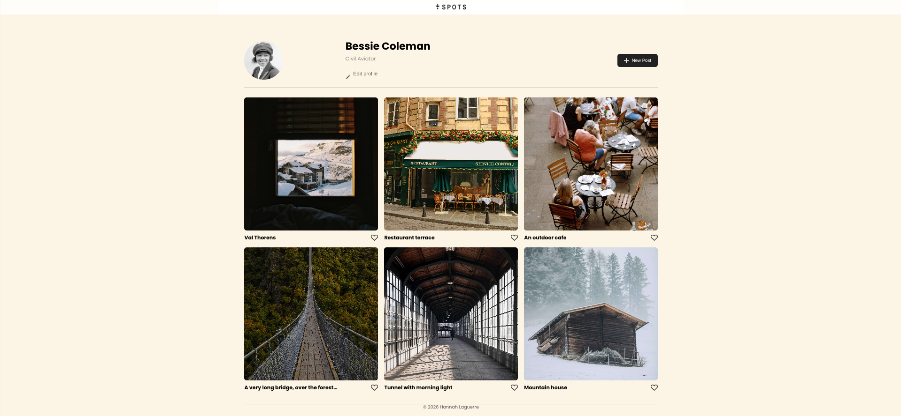
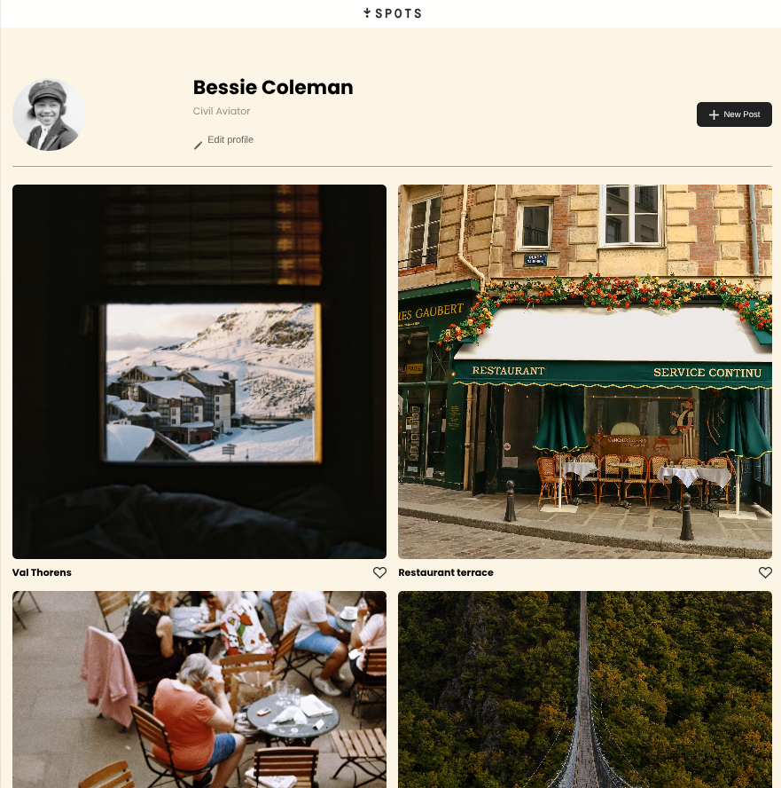
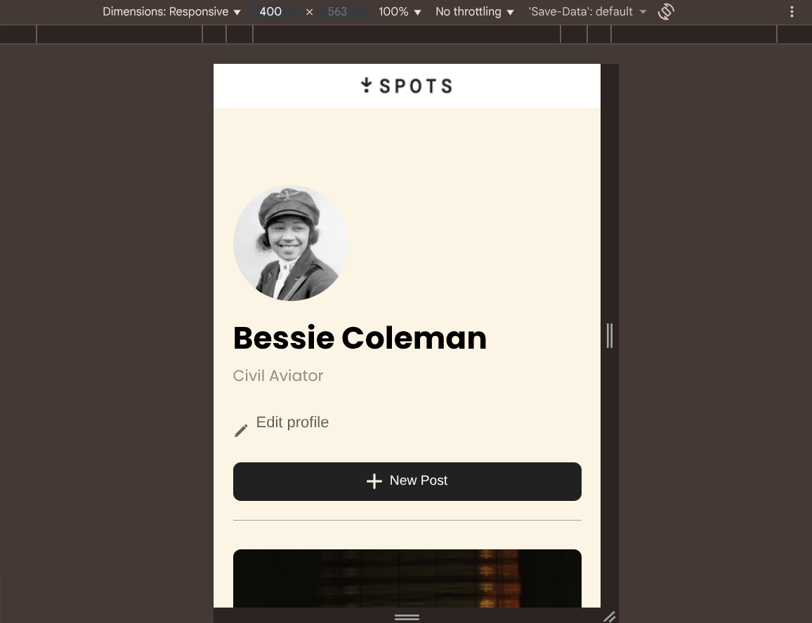

# Project 3: Spots

### Overview

- Intro
- Figma
- Images
- Project Videos
- Live Project
- Features
- Technologies

**Intro**

Spots is a responsive social-media style webpage created by Hannah Laguerre as part of the TripleTen Web Development program.

The page shows a user profile and a grid of photo cards that automatically adjust for desktop, tablet, and mobile screens.

This project helped me practice responsive design, BEM methodology, and real-world layout building.

Technologies and Techniques Used:

- JavaScript
- Webpack
- REST API
- Flexbox
- Media Queries
- Normalize.css
- Custom fonts (Poppins)
- BEM Methodology

This project also helped me practice:

- File structure organization
- Responsive layouts
- Text overflow handling
- Form validation
- API requests
- Loading states
- Git and GitHub workflow

**Figma**

The page includes:

- Profile section with avatar, name, job title, and edit button
- Avatar update modal
- Add New Post button
- Responsive photo cards
- Like/unlike button on cards
- Delete card confirmation modal
- Image preview modal
- Footer section
- Overflow handling for long names/descriptions

The layout matches the TripleTen Figma design at different screen sizes.

- [Link to the project on Figma](https://www.figma.com/design/mXGZ6wZ4QPKx5KjpHX9QCV/Sprint-9-Project--Spots?node-id=0-1&p=f&t=VjY3pi81bhAjIDZH-0)

**Images**

## Desktop View

## Tablet View

## Mobile View

## Project Pitch Videos

Check out these videos, where I describe my project
and some challenges I faced while building it:

- [First Video Title] (https://www.loom.com/share/eb54ebdc858e47c39c6af33b78aebfce)
- [Second Video Title](https://www.loom.com/share/02e45e15f84a467aa7525c5111075eee)
- [Third Video Title] (https://www.loom.com/share/9bc45930dc444a7e9a70f6f340cecc59)

## Live Project

Deployed on GitHub Pages:
https://designwithpri.github.io/se_project_spots/

## Features

- Edit profile modal
- Update profile avatar
- Add new posts
- Like/unlike cards
- Delete cards
- Image preview modal
- Form validation
- API data persistence
- Loading states: "Saving..." and "Deleting..."
- Responsive design

## Technologies

- HTML
- CSS (BEM)
- JavaScript
- Webpack
- REST API
- Git/GitHub
